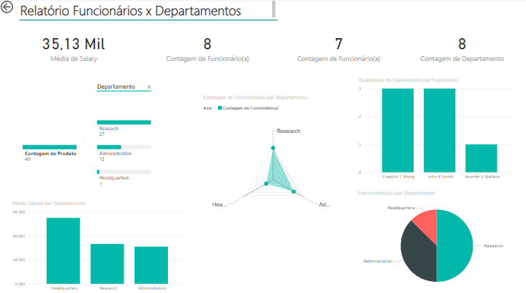

# 🌟 Relatório Interativo: Funcionários x Departamentos

Bem-vindo ao repositório que transforma **dados brutos** em **insights poderosos**! 🚀

Este projeto apresenta um **dashboard dinâmico** e visualmente atrativo, que oferece uma visão clara e estratégica sobre funcionários, departamentos e projetos. Construído com uma ferramenta de **Business Intelligence (BI)**, o dashboard foi desenvolvido a partir de dados de um banco de dados **MySQL**, cuidadosamente limpos e transformados no **Power BI** para proporcionar uma experiência rica e interativa.

Este desafio de projeto foi proposto no curso **Criando um Dashboard corporativo com integração com MySQL e Azure** pela professora [Juliana Mascarenhas](https://www.linkedin.com/in/juliana-mascarenhas-ds/) no Bootcamp da [NTT DATA](https://www.linkedin.com/company/ntt-data-europe-latam/posts/?feedView=all) - Engenharia de Dados com Python, disponível na plataforma da [DIO](https://www.dio.me/).

 

## 🔄 **Processo de Limpeza e Transformação dos Dados**

O banco de dados utilizado passou por uma profunda limpeza e transformação no Power BI para garantir a consistência e qualidade dos dados, incluindo:

### 1. **Tabela `Employee`**
- **Colunas removidas:** `BDate`, `Address`, `F-Name`, `Minit`, `Lname` (informações irrelevantes foram descartadas).
- **Nome Completo:** Mesclagem de colunas para criar a coluna `Nome Completo`, simplificando a exibição.
- **Remoção de duplicatas:** Garantimos que não houvesse registros de funcionários com nomes duplicados.
- **Salário:** Padronização do campo `Salary` em formato decimal fixo.
- **Gerentes:** Funcionários foram associados aos seus gerentes; valores nulos em `Super_ssn` foram substituídos pela palavra "Gerente".

### 2. **Mesclagem com `Department`**
- A tabela de funcionários foi mesclada com a tabela `Department`, mantendo apenas o nome do departamento, facilitando a análise.

### 3. **Mesclagem com `Dept_Locations`**
- Mesclamos os dados com a tabela `Dept_Locations`, deixando apenas a localização do departamento visível, para maior clareza sobre onde cada setor está localizado.

### 4. **Mesclagem com `Project`**
- Por fim, os dados foram mesclados com a tabela de projetos, unificando informações de localização, horas trabalhadas e associação de funcionários a projetos. Registros com horas zeradas foram removidos, resultando em uma análise mais precisa.

 

## 🎯 **O que você vai encontrar no Dashboard?**

   

Nosso dashboard foi desenhado para oferecer uma experiência intuitiva e rica em detalhes. Aqui estão os principais insights:

- **📊 Média Salarial:** R$35,13 mil, proporcionando uma visão clara da remuneração dos colaboradores.
- **👥 Contagem de Funcionários:** A empresa conta atualmente com 8 funcionários.
- **🏢 Funcionários por Departamento:** Um gráfico de radar interativo mostra a distribuição dos funcionários por departamentos, como:
  - Research (27)
  - Administration (12)
  - Headquarters (1)
- **📈 Salário por Departamento:** Comparação das médias salariais entre departamentos, utilizando um gráfico de barras.
- **👶 Dependentes por Funcionário:** Visualize facilmente a quantidade de dependentes por colaborador.
- **🍕 Proporção de Funcionários:** Um gráfico de pizza revela a proporção de funcionários por setor, permitindo uma visão rápida da distribuição interna.

 

## 🗂 **O Banco de Dados por Trás do Dashboard**

As informações apresentadas no dashboard são extraídas de várias tabelas relacionadas no banco de dados MySQL, como:

- **employee:** Contém informações sobre cada funcionário.
- **department:** Detalhes sobre cada departamento da empresa.
- **dept_locations:** Localizações físicas dos departamentos.
- **project:** Informações sobre projetos e seus detalhes.
- **works_on:** Dados sobre os funcionários e os projetos em que trabalham.
- **dependent:** Informações sobre dependentes dos funcionários.

 

## 🧭 **Por que este Dashboard é Importante?**

Este dashboard ajuda você a:

- **📊 Analisar** a distribuição de funcionários entre os departamentos.
- **💸 Comparar** as médias salariais de cada departamento.
- **👶 Entender** a quantidade de dependentes por funcionário.
- **📍 Identificar** as áreas da empresa com maior concentração de funcionários e os principais projetos em andamento.

 

## 🚀 **Como Utilizar?**

Siga os passos abaixo para começar a explorar os dados:

1. Clone este repositório.
2. Abra o dashboard na sua ferramenta de BI preferida.
3. Navegue pelos gráficos e análises para extrair insights valiosos!

 

## 🔧 **Script do Banco de Dados**

Quer criar sua própria base de dados? O script SQL necessário para gerar as tabelas está disponível neste repositório. Utilize-o para construir o banco de dados MySQL e personalizar sua análise.

 

## 🤝 **Contribuições**

Se você deseja colaborar, suas ideias são mais que bem-vindas! Contribua adicionando novos recursos, corrigindo bugs, ou melhorando a documentação.

 

## 📜 **Licença**

Este projeto está licenciado sob a [Licença MIT](LICENSE), permitindo que você utilize, modifique e distribua livremente!

 

## 👨‍💻 Expert

    
    
&nbsp&nbsp&nbspMarcos Winther 
    &nbsp&nbsp&nbsp
    <a href="https://github.com/MarcosWinther">
    GitHub</a>&nbsp;|&nbsp;
    <a href="https://www.linkedin.com/in/marcoswinthersilva/">LinkedIn</a>
    

  

---

⌨️ com 💜 por [Marcos Winther](https://github.com/MarcosWinther)
